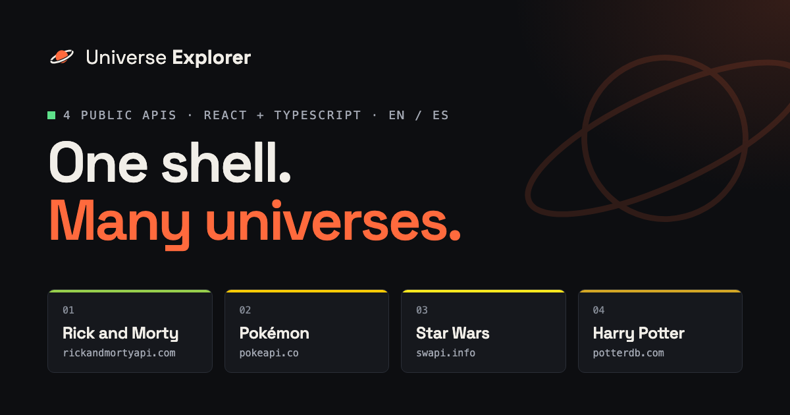
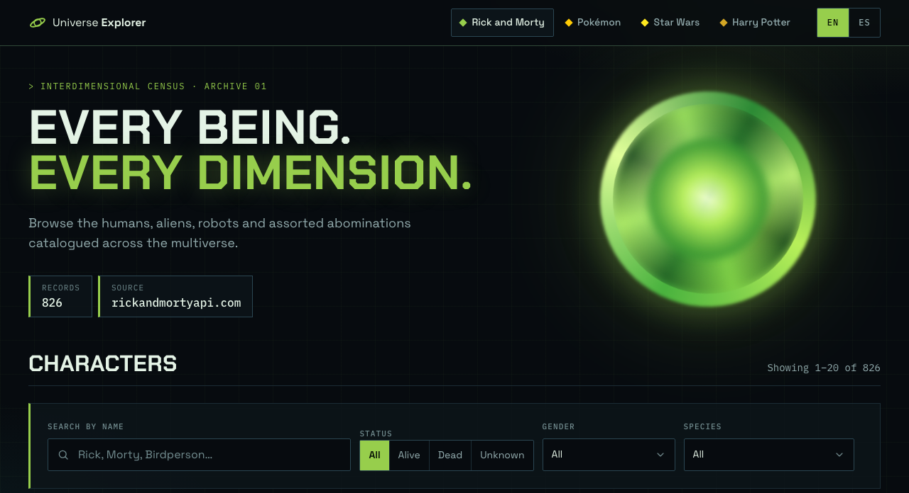
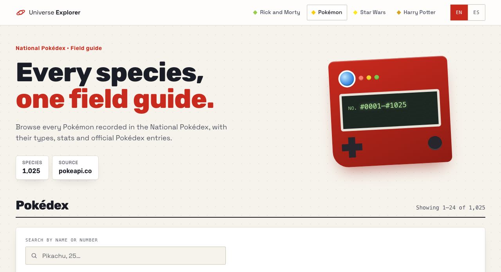
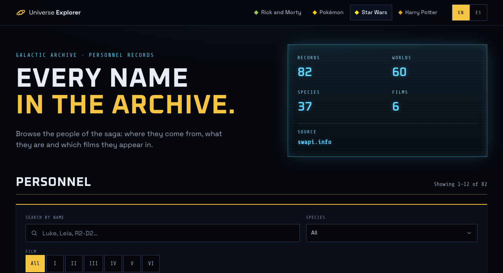
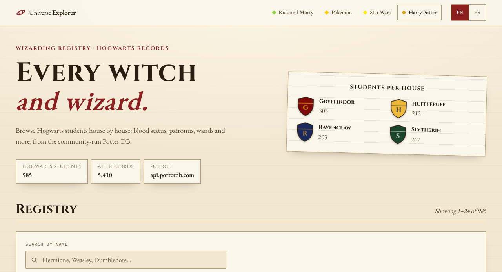

# Universe Explorer

[](https://github.com/JosueOmar320/universe-explorer/actions/workflows/ci.yml)

**[Live demo →](https://josueomar320.github.io/universe-explorer/)**

[](https://josueomar320.github.io/universe-explorer/)

A multi-universe frontend playground. Each "universe" consumes a different public API and ships
its own visual identity — typography, palette, layout and copy — while sharing a common shell,
data layer and component foundation. Built incrementally, one reviewable commit at a time.

| Rick and Morty                                                           | Pokémon                                                      |
| ------------------------------------------------------------------------ | ------------------------------------------------------------ |
|  |         |
| **Star Wars**                                                            | **Harry Potter**                                             |
|           |  |

## Highlights

- **Four APIs, four data strategies.** Server-side search and pagination (Rick and Morty), a
  cached index searched locally (Pokémon), whole collections filtered in memory (Star Wars) and
  JSON:API filters with next-page prefetching (Harry Potter) — each chosen for its API.
- **One architecture, enforced by types.** A universe registry drives navigation, routing and
  the home page; marking a universe as available without registering its routes doesn't compile.
- **One search for four APIs.** ⌘K / Ctrl+K searches every universe at once, each with its own
  strategy, in an accessible command palette that takes on the current universe's theme.
- **Every state is designed.** Loading skeletons, empty results, classified errors (network,
  timeout, rate limit, not found) with retry, and an offline state that resumes on reconnect.
- **Accessible and bilingual.** Keyboard and screen-reader friendly (focus management, live
  regions, WCAG AA contrast), English and Spanish with type-checked translation keys.
- **Shipped like production code.** Lint, format, type-check, ~200 unit and integration tests,
  the build, end-to-end plus axe accessibility tests on desktop and mobile, and Lighthouse
  score and size budgets run on every pull request; `main` deploys to GitHub Pages only after
  they all pass.

| Universe       | API                                                 | Data strategy                              |
| -------------- | --------------------------------------------------- | ------------------------------------------ |
| Rick and Morty | [rickandmortyapi.com](https://rickandmortyapi.com/) | Server-side search, filters and pagination |
| Pokémon        | [pokeapi.co](https://pokeapi.co/)                   | Cached index, local search, per-card data  |
| Star Wars      | [swapi.info](https://swapi.info/) (SWAPI mirror)    | Whole collections, filtered in memory      |
| Harry Potter   | [PotterDB](https://potterdb.com/) (replaces Marvel) | JSON:API filters, prefetched next page     |

Lighthouse on the production build (mobile, simulated slow 4G), checked on every pull request:

| Page           | Performance | Accessibility | Best practices | SEO |
| -------------- | ----------: | ------------: | -------------: | --: |
| Home           |          99 |           100 |            100 | 100 |
| Rick and Morty |          96 |           100 |            100 | 100 |
| Pokémon        |          96 |           100 |            100 | 100 |
| Star Wars      |          96 |           100 |            100 | 100 |
| Harry Potter   |          96 |           100 |            100 | 100 |

## Tech stack

- [React 19](https://react.dev) + [TypeScript](https://www.typescriptlang.org) (strict, `noUncheckedIndexedAccess`)
- [Vite](https://vite.dev) for dev server and bundling
- [React Router](https://reactrouter.com) (data router) — URL state, nested layouts, lazy routes, error boundaries
- [TanStack Query](https://tanstack.com/query) — caching, request deduplication, retries, pagination, prefetching
- [i18next](https://www.i18next.com) + [react-i18next](https://react.i18next.com) — English and Spanish, type-checked keys
- CSS Modules + CSS custom properties (design tokens) — no UI kit, every component is hand-built
- [Vitest](https://vitest.dev) + [Testing Library](https://testing-library.com) + [MSW](https://mswjs.io) for tests
- [Oxlint](https://oxc.rs) (incl. `jsx-a11y`) and [Prettier](https://prettier.io)

## Architecture

```
                         App shell (router, providers)
                                    │
           ┌────────────────────────┼─────────────────────────┐
     Universe registry          Universes                    i18n
   (metadata + status)     (feature folders)          (src/locales/<lang>)
                                    │
                    service → queryOptions → hooks → UI
                                    │
                   API client (src/config/apis.ts)
```

```
src/
├── app/                      # Wiring: providers, router, shell, hub pages
│   ├── App.tsx               # I18nextProvider + QueryClientProvider + RouterProvider
│   ├── router.tsx            # Route tree (universe routes are derived from the registry)
│   ├── queryClient.ts        # Global caching and retry policy
│   ├── layout/AppShell.tsx   # Header, switchers, footer, [data-universe] theming hook
│   ├── components/           # Shell-only components (UniverseSwitcher, LanguageSwitcher…)
│   └── pages/                # Home (hub), 404, route error boundary
├── config/
│   └── apis.ts               # Base URL + timeout of every external API (env-overridable)
├── i18n/                     # i18next instance, supported languages, resources
├── locales/
│   ├── en/                   # common.json (shell + shared UI), rickAndMorty.json, …
│   └── es/
├── shared/                   # Universe-agnostic building blocks
│   ├── api/                  # createApiClient, HttpError, error classification
│   ├── components/           # Button, BackLink, Pagination, form fields, QueryErrorState…
│   ├── hooks/                # usePageParam, useUrlFilters, useResultsFocus, useFocusOnPathChange
│   ├── icons/                # Inline SVG icons
│   ├── styles/               # Design tokens + global styles
│   └── utils/                # Pure helpers (cx, pagination range, pickOption)
├── universes/
│   ├── registry.ts           # Every universe: name, status, accent colour
│   ├── routes.ts             # Route tree of each *available* universe (type-checked)
│   ├── search.ts             # Each universe's part in the global search (type-checked)
│   ├── pokemon/, star-wars/, harry-potter/   # Same layout as the folder below
│   └── rick-and-morty/       # Everything specific to one universe
│       ├── api/              # DTO types, service, query keys/options
│       ├── hooks/            # useCharacters, useCharacter, useEpisodes, useCharacterFilters
│       ├── components/       # CharacterCard, PortalHero, StatusBadge…
│       ├── layout/           # Universe entry: loads theme + fonts
│       ├── pages/            # Route components
│       ├── test/             # Fixtures + MSW handlers mimicking the real API
│       ├── filters.ts        # Filter options + URL parsing
│       ├── paths.ts          # Typed route builders
│       ├── routes.ts         # Lazy route tree
│       └── theme.css         # Token overrides under [data-universe='rick-and-morty']
├── test/                     # Test setup, shared MSW handlers (Node server + browser worker)
└── types/                    # Global type augmentations (env, i18next, CSS custom props)

build/                        # Vite plugins (static-hosting entry points, MSW worker)
e2e/                          # Playwright specs + axe fixture, run against the mocked build
```

**Dependency rule:** `app` → `universes` → `shared`. Shared code never imports from a
universe, and universes never import from each other.

### What is shared and what stays in a universe

Shared code is what every universe needs _the same way_: the HTTP client, error handling,
pagination, URL-backed filters, form controls, loading/empty/error states. Anything that
expresses a universe's identity — cards, heroes, badges, layouts, copy — stays in its folder,
even if two universes end up with similar components. Duplicating a card is cheaper than a
"generic card" with a dozen props.

### Key decisions

- **Data fetching: TanStack Query, not RTK Query.** Every API here is public and read-only,
  so what matters is caching, deduplication, retries, pagination and prefetching — which
  TanStack Query covers without a global store. RTK Query would add Redux (store, provider,
  one reducer + middleware per API) to manage state the app doesn't have; its strengths
  (tag invalidation after mutations, sharing a store with client state) don't apply yet.
  Each universe's `queryOptions` factories keep query keys and fetchers in one place.
- **Configuration in one place.** API base URLs and timeouts live in `src/config/apis.ts` and
  can be overridden with `VITE_*` variables (see `.env.example`) — e.g. to route an
  API through a proxy or point it at a mock server.
- **Errors are classified, not just caught.** Network, timeout, rate-limit, not-found and
  server errors get specific messages; only transient ones are retried. While offline,
  queries pause and resume on reconnect, and the UI says so.
- **Universe registry as the single source of truth.** Navigation, the home page and the
  router derive from it. Marking a universe as available without registering its routes is a
  TypeScript error.
- **i18n by namespace.** `common` holds shell/shared copy; each universe has its own
  namespace. English is the reference: keys are type-checked and every language must provide
  the same keys at compile time. Data coming from the APIs is never translated.
- **Theming via design tokens.** Shared components only use CSS variables; each universe
  overrides them under `[data-universe]`.
- **Global search as a contract, not a special case.** Each universe exports a small
  `UniverseSearch` (`search` + `listingHref`) built on its own queries, so the ⌘K palette
  reuses the listings' cache and strategy: the Pokédex index and Star Wars people are searched
  in memory, Rick and Morty and PotterDB on the server. A `Record` keyed by available universes
  makes a missing one a compile error. The palette and every provider load on first use.
- **State lives where it belongs.** Server state in TanStack Query, view state in the URL
  (`?name=&status=&page=`), the language choice in `localStorage`. No global client store.
- **Code splitting per universe, without the waterfall.** Universe routes are lazy, so their
  JS, CSS and fonts load only when the user enters that universe. Opening a universe directly
  would then download in a chain (main bundle → route chunks and CSS → fonts), so each
  universe's entry HTML preloads its landing chunks, CSS and the fonts its first view renders:
  LCP on slow 4G went from 2.6–2.9 s to 2.4 s.
- **Each API gets the fetching strategy it needs.** PokéAPI has no search and its list only
  returns names, so the app downloads the whole Pokédex index once (~9 kB gzipped) and
  searches/paginates it locally. Card types come from the 18 type lists (~20 kB of JSON each,
  already needed by the type filter), not from each Pokémon's own record: that one is ~300 kB
  of JSON, and parsing 24 of them per page blocked the main thread on slower devices. Cards use 96px pixel sprites (~1–7 kB) instead of the official artwork
  (100–200 kB each), which would add several megabytes per page.
- **Server-side data when the dataset is big.** PotterDB has ~5,400 characters, so its
  JSON:API filters, sorting and pagination run on the server (repeated `filter[house_in][]`
  params included), with the next page prefetched because the API answers in ~1 s. The
  default view shows the 985 Hogwarts students instead of owls and one-off mentions.
- **No borrowed artwork.** SWAPI has no images, and the ones other projects use come from
  copyrighted wikis, so the Star Wars universe is purely typographic: data readouts and
  film "pips" instead of photos.
- **API-provided translations over our own.** PokéAPI ships official names in many
  languages (types, categories, Pokédex entries); those are shown in the selected language
  instead of being translated by the app.
- **API quirks are handled at the service boundary.** The Rick and Morty API returns 404 for
  "no results" (mapped to an empty page) and a bare object for single-id episode requests
  (normalized to an array).

### Accessibility

- Semantic landmarks, a skip link, and focus moved to `<main>` after route changes.
- Paging moves focus to the results heading; result counts are announced via a live region.
- The global search is a native modal `<dialog>` with the ARIA combobox pattern: focus stays in
  the input, arrow keys move `aria-activedescendant`, Enter opens, Escape closes and gives focus
  back, and a live region announces the number of results.
- Native controls for filters (radio group, `<select>`, search input) with visible labels.
- Text colours meet WCAG AA (≥ 4.5:1) on every surface; status is conveyed by text, not colour.
- `<html lang>` follows the selected language; language buttons are announced in their own
  language.
- `prefers-reduced-motion` disables animations.

### Adding a universe

1. Create `src/universes/<id>/` (`api/`, `components/`, `pages/`, `routes.ts`, `theme.css`).
2. Add its API to `src/config/apis.ts`.
3. Add a `src/locales/<lang>/<namespace>.json` per language and register it in
   `src/i18n/resources.ts`.
4. Set `status: 'available'` in `src/universes/registry.ts` and add its route to
   `src/universes/routes.ts` (TypeScript enforces both).

## Getting started

Requires Node.js `>= 22.22` (see `.nvmrc`).

```bash
npm install
npm run dev
```

Optional environment variables are documented in `.env.example`.

To work offline or without hitting the public APIs, `npm run dev:mock` serves every API from
the test fixtures through a [MSW](https://mswjs.io) service worker. This mode only exists in
development and end-to-end runs: production builds don't include the mocks.

## Scripts

| Script                  | Purpose                                                        |
| ----------------------- | -------------------------------------------------------------- |
| `npm run dev`           | Start the Vite dev server                                      |
| `npm run dev:mock`      | Dev server with every API mocked from fixtures (works offline) |
| `npm run build`         | Type-check and build for production                            |
| `npm run preview`       | Serve the production build locally                             |
| `npm run build:mock`    | Production build in mock mode, into `dist-mock/` (used by E2E) |
| `npm run preview:mock`  | Serve the mocked build                                         |
| `npm run typecheck`     | Run the TypeScript compiler (no emit)                          |
| `npm run lint`          | Lint with Oxlint (warnings fail the run)                       |
| `npm run format:check`  | Verify formatting with Prettier                                |
| `npm test`              | Run the unit and integration tests once                        |
| `npm run test:watch`    | Run tests in watch mode                                        |
| `npm run test:coverage` | Run the tests with a coverage report (`coverage/`)             |
| `npm run test:e2e`      | Build in mock mode and run the Playwright + axe suite          |
| `npm run lighthouse`    | Lighthouse CI on `dist/` (run `npm run build` first)           |
| `npm run validate`      | The `validate` CI job: lint, format, types, coverage, build    |

Each script is a separate step so the CI pipeline can run (and report) them individually. The
first `test:e2e` run needs a browser: `npx playwright install chromium`.

## CI/CD

[`.github/workflows/ci.yml`](.github/workflows/ci.yml) runs on every push to `main` and every
pull request:

```
validate:   npm ci → lint → format check → type-check → tests + coverage → build ─┐
e2e:        npm ci → Playwright + axe, desktop and mobile                         ─┼→ deploy
lighthouse: npm ci → build → Lighthouse CI (scores + budgets)                     ─┘ (main only)
```

- **Validate** (every run): Node.js from `.nvmrc`, cached npm downloads, one step per check.
  Every check runs even when an earlier one fails, so one run reports every problem. Lint and
  test failures show up as inline annotations on the pull request diff; the test report and
  the coverage totals land in the job summary.
- **E2E** (every run, in parallel): end-to-end and accessibility tests against a mocked
  build; the HTML report is uploaded as an artifact when something fails.
- **Lighthouse** (every run, in parallel): audits the five entry points of the production build
  three times each, with the real APIs, against [`lighthouserc.yml`](lighthouserc.yml):
  accessibility, best practices and SEO must score 100, performance at least 90, and each page
  stays within its JS (170 kB), CSS (20 kB) and font (90 kB) budgets, plus CLS and TBT limits.
  The scores land in the job summary and the full reports are uploaded as an artifact.
- **Deploy** (pushes to `main` only): runs only if all three jobs passed and publishes _the same
  build_ that was validated to GitHub Pages — there is no second, unverified build.
- Read-only permissions by default; only the deploy job gets `pages: write` / `id-token: write`.
- [Dependabot](.github/dependabot.yml) opens a weekly pull request with minor and patch updates
  (majors one by one) and a monthly one for the GitHub Actions; all go through this pipeline.
- Outdated pull request runs are cancelled; deployments from `main` are never interrupted.

### GitHub Pages specifics

- Project sites are served under `/<repo>/`, so CI builds with `BASE_PATH=/<repo>/`
  (Vite's `base`); the router picks it up from `import.meta.env.BASE_URL`.
- Pages has no SPA rewrites, so a build plugin ([`build/spaEntryPoints.ts`](build/spaEntryPoints.ts))
  (which also adds the preloads described above)
  writes one `index.html` per universe — `/pokemon/` and friends answer with HTTP 200 for
  crawlers, link previews and Lighthouse — plus a `404.html` copy that boots the app for deeper
  links such as `/rick-and-morty/characters/1` (served with a 404 status).
- One-time setup: **Settings → Pages → Build and deployment → Source: GitHub Actions**.
  Pages on a private repository requires a paid GitHub plan; on Free, make the repo public.

## Testing

Tests live next to the code they cover (`*.test.ts(x)`) and query the DOM by role and
accessible name, so they also guard accessibility. Coverage of the app and build code is about
92% of lines and 87% of branches; CI fails below 90% / 85% (routing and layouts are mostly
wiring, covered end to end instead).

- **Unit:** pagination range, filter parsing per universe, local search, language detection,
  error classification, retry policy and each API's data formatting (episode grouping, SWAPI
  "unknown" values, PokéAPI translations).
- **API layer:** the HTTP client (params, timeouts, cancellation) and every universe's service
  against [MSW](https://mswjs.io) handlers that reproduce the real APIs' quirks.
- **Components/hooks:** the debounced `SearchField` (including a keystroke race),
  `Pagination`, `useUrlFilters`, the app shell and language switcher.
- **Integration:** the list and detail pages of all four universes in a memory router with a
  fresh QueryClient — pagination, filters and URL state, empty/error/offline states,
  list → detail → back, cache seeding, language switching and focus management.
- **Build tooling:** the static-hosting plugin, in a separate Node test project.
- **End-to-end ([`e2e/`](e2e)):** [Playwright](https://playwright.dev) drives the real
  production bundle in Chromium, on a desktop and a mobile viewport. The APIs are served by a
  service worker running _the same MSW handlers_ as the unit tests, so runs are fast, offline
  and deterministic. Specs cover search → detail → back in every universe, direct links,
  universe switching and theming, the persisted language, the global search, the skip link and
  the 404 page.
  They also check that each first view preloads exactly the fonts it renders, since that list
  is maintained by hand in `vite.config.ts`.
- **Accessibility:** [axe](https://github.com/dequelabs/axe-core) checks every page type
  (home, the four listings and detail pages, 404, Spanish) against WCAG 2.2 A/AA. Text that axe
  measures below the AA ratio but files as "needs review" (very short labels) fails too, as it
  does in Lighthouse. Every E2E test also fails on uncaught errors, console errors and requests
  to unmocked hosts.

## Roadmap

- [x] Project setup and tooling
- [x] App shell, universe registry and theming foundation
- [x] Rick and Morty: listing, search, filters, detail page
- [x] Tests (Vitest + Testing Library + MSW)
- [x] Architecture review: API config, i18n (EN/ES), error states, accessibility
- [x] CI: lint, typecheck, tests and build on GitHub Actions
- [x] CD: deploy `main` to GitHub Pages
- [x] Pokémon: Pokédex with local search, type filter and detail page
- [x] Star Wars: personnel archive with search, film/species filters and detail page
- [x] Harry Potter: registry with server-side search, house scope and detail page (replaces
      Marvel, whose public API was retired in late 2025)
- [x] Cross-universe review: HTTP 200 entry points on Pages, contrast and header fixes
- [x] Brand icons and link previews (favicon, apple-touch-icon, Open Graph image)
- [x] End-to-end tests with Playwright, with automated accessibility checks (axe)
- [x] Lighthouse CI with score budgets in the pipeline
- [x] Preload each universe's route chunks, CSS and fonts (LCP under 2.5 s everywhere)
- [x] Global search across universes (⌘K command palette)

## Disclaimer

Fan-made portfolio project. Characters, names and trademarks belong to their respective owners.
No official artwork or fonts are bundled; visuals are original CSS inspired by each universe.
Character pictures and sprites are loaded at runtime from the APIs that provide them.
