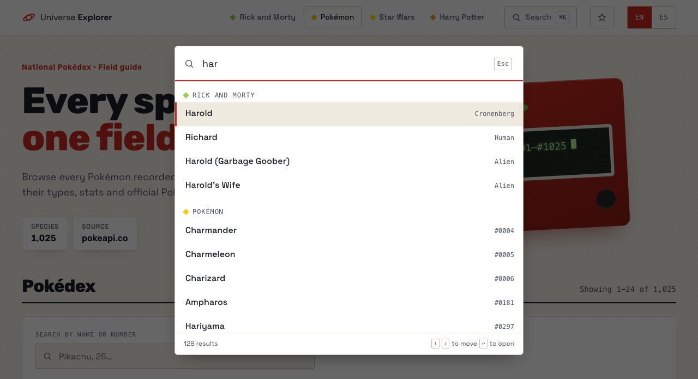
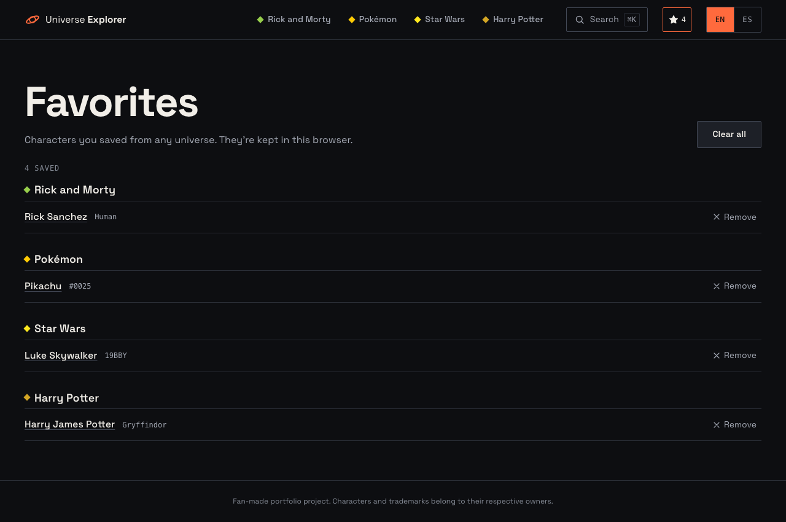
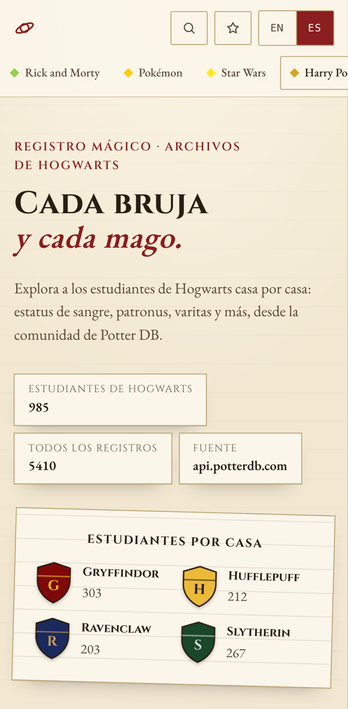
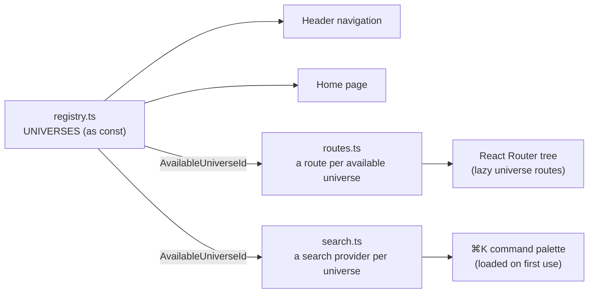
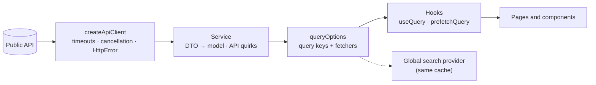
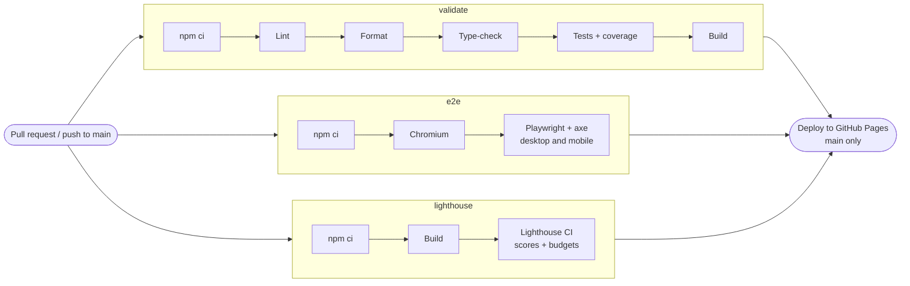

<div align="center">

<a href="https://josueomar320.github.io/universe-explorer/">
  
</a>

# Universe Explorer

**Four public APIs, four visual identities, one React + TypeScript shell.**

Each universe gets the data strategy its API calls for and a design of its own, on a shared,
type-safe architecture with automated tests, accessibility checks and performance budgets in CI.

[](https://github.com/JosueOmar320/universe-explorer/actions/workflows/ci.yml)
[](CHANGELOG.md)
[](#-testing--quality)
[](#-accessibility)
[](LICENSE)

**[Live demo →](https://josueomar320.github.io/universe-explorer/)** ·
[Architecture](#-architecture) · [Testing](#-testing--quality) ·
[Getting started](#-getting-started) · [Changelog](CHANGELOG.md)

| 4 universes | 233 unit & integration tests | 92% line coverage | 106 E2E tests | Lighthouse a11y 100 |
| :---------: | :--------------------------: | :---------------: | :-----------: | :-----------------: |

</div>

## 📸 Showcase

The same header, routing, components and data layer; a different typography, palette, layout
and voice in each universe.

| Rick and Morty: character census                                         | Pokémon: field guide                                         |
| ------------------------------------------------------------------------ | ------------------------------------------------------------ |
|  |         |
| **Star Wars: personnel archive**                                         | **Harry Potter: registry**                                   |
|           |  |

<table>
  <tr>
    <th>Global search (⌘K) and favorites across universes</th>
    <th>Mobile, in Spanish</th>
  </tr>
  <tr>
    <td width="72%">
      
      <br><br>
      
    </td>
    <td width="28%">
      
    </td>
  </tr>
</table>

## ⚡ Technical highlights

|                      |                                                                                                                                                                                                       |
| -------------------- | ----------------------------------------------------------------------------------------------------------------------------------------------------------------------------------------------------- |
| 🔄 **Data fetching** | One strategy per API: server-side search, a cached index searched locally, whole collections filtered in memory, JSON:API filters. Next pages are prefetched; detail pages start from the list cache. |
| 🧠 **Type safety**   | Strict TypeScript 7 with `noUncheckedIndexedAccess`. Routes, global search and translations are typed against the universe registry, so a half-registered universe doesn't compile.                   |
| 🔍 **Search**        | A ⌘K / Ctrl+K palette searches all four APIs at once, reusing each universe's cache and strategy. It loads on first use.                                                                              |
| ♿ **Accessibility** | WCAG 2.2 AA checked by axe on every page type, on desktop and mobile; a Lighthouse accessibility score of 100 is a CI gate.                                                                           |
| 🌎 **i18n**          | English and Spanish, one namespace per universe, translation keys checked at compile time. Official API translations (PokéAPI) are used when they exist.                                              |
| 🧪 **Testing**       | 233 unit and integration tests (92% lines) and 106 Playwright runs that share the same MSW fixtures, so every layer is tested against the same API behavior.                                          |
| ⚡ **Performance**   | Code split per universe, with each entry page preloading its chunks, CSS and fonts. JS, CSS and font byte budgets per page fail the build when exceeded.                                              |
| 🚀 **CI/CD**         | Three parallel jobs gate a GitHub Pages deploy of the exact build that was validated.                                                                                                                 |

## ✨ Features

- **Four themed universes.** Browse, search, filter and open detail pages for Rick and Morty
  characters, Pokémon, Star Wars people and Harry Potter characters.
- **Global search.** ⌘K / Ctrl+K searches every universe at once in a command palette that takes
  on the current universe's theme.
- **Favorites across universes.** A star next to a record's name saves it; `/favorites` lists
  them by universe, kept in the browser and synced across tabs.
- **Shareable URLs.** Search, filters and page live in the query string, so every view can be
  bookmarked, shared or restored with the back button.
- **Every state is designed.** Loading skeletons, empty results, classified errors (network,
  timeout, rate limit, not found) with retry, and an offline state that resumes on reconnect.
- **English and Spanish.** A persisted language switcher; `<html lang>` follows it.
- **View transitions.** Opening a record morphs its name from the card into the page heading
  (skipped with reduced motion and in browsers without support).

## 🌌 Universes and APIs

Each API has different limits, so each universe fetches data its own way instead of forcing one
pattern on all four.

| Universe       | API                                                 | Data strategy                                                                | Why                                                                                              |
| -------------- | --------------------------------------------------- | ---------------------------------------------------------------------------- | ------------------------------------------------------------------------------------------------ |
| Rick and Morty | [rickandmortyapi.com](https://rickandmortyapi.com/) | Server-side search, filters and pagination; next page prefetched             | The API supports search and filters natively                                                     |
| Pokémon        | [pokeapi.co](https://pokeapi.co/)                   | Pokédex index cached once (~9 kB gzipped), searched and paged locally        | No search endpoint and the list only returns names; one Pokémon's full record is ~300 kB of JSON |
| Star Wars      | [swapi.info](https://swapi.info/) (SWAPI mirror)    | Whole collections fetched once, filtered in memory                           | A small dataset that the mirror returns in a single response                                     |
| Harry Potter   | [PotterDB](https://potterdb.com/) (JSON:API)        | JSON:API filters, sorting and pagination on the server; next page prefetched | ~5,400 characters and ~1 s responses                                                             |

Harry Potter replaces Marvel, whose public API was retired in late 2025. API quirks (a 404 for
"no results", a bare object instead of an array, SWAPI's `"unknown"` values) are normalized at
the service boundary, so components never see them.

## 🧰 Tech stack

|                    |                                                                                                                                                                                                                                                                                                                                                                                                                                         |
| ------------------ | --------------------------------------------------------------------------------------------------------------------------------------------------------------------------------------------------------------------------------------------------------------------------------------------------------------------------------------------------------------------------------------------------------------------------------------- |
| **Core**           |                                                                                                                                                                            |
| **Routing & data** |                                                                                                                                                                                                                              |
| **i18n & styling** |                                                                                                                                                                                                                          |
| **Testing**        |      |
| **Quality**        |                                                                                                                                             |
| **Delivery**       |      |

No UI kit: every component is hand-built with CSS Modules and design tokens.

## 🧱 Architecture

The code is split into three layers with one dependency rule: `app` → `universes` → `shared`.
Shared code never imports from a universe, and universes never import from each other.

### The universe registry drives everything

[`src/universes/registry.ts`](src/universes/registry.ts) lists every universe once. Navigation and
the home page read it directly; the router and the global search are typed against the ids it
marks as available. Making a universe available without registering its routes or its search
provider is a compile error, not a runtime surprise.



### Inside a universe: one data flow, four strategies



### Key decisions

- **TanStack Query, not RTK Query.** Every API is public and read-only, so what matters is
  caching, deduplication, retries, pagination and prefetching, which TanStack Query covers
  without a global store. Redux would manage state the app doesn't have.
- **A deliberate cache policy.** Data stays fresh for 5 minutes and cached for 30, with no
  refetch on window focus. Only transient errors (network, server, rate limit) are retried, at
  most twice; while offline, queries pause and resume on reconnect.
- **Perceived speed from the cache.** Lists keep the previous page on screen while the next one
  loads, the following page is prefetched, and detail pages start from the record already in the
  cached list, so opening a record renders without waiting.
- **State lives where it belongs.** Server state in TanStack Query, view state in the URL
  (`?name=&status=&page=`), the language and favorites in `localStorage`. No global client store.
- **Global search as a contract.** Each universe exports a small `UniverseSearch` built on its
  own queries, so the palette reuses each listing's cache and strategy instead of special-casing
  four APIs.
- **Identity stays in the universe.** Shared code is what every universe needs the same way
  (HTTP client, errors, pagination, URL filters, form controls, loading and error states). Cards,
  heroes and layouts stay in their universe's folder: duplicating a card is cheaper than a
  "generic card" with a dozen props.

<details>
<summary><strong>More decisions</strong> (favorites, code splitting, payload size, static hosting…)</summary>

- **Favorites as snapshots in a tiny external store.** Saving a record stores its name, short
  detail and link, so `/favorites` lists records from every universe without calling any API.
  Components read it through `useSyncExternalStore`, which keeps tabs in sync through `storage`
  events. Unreadable data is ignored, and without storage (private mode, full quota) favorites
  still work for the session.
- **Code splitting without the waterfall.** Universe routes are lazy, so their JS, CSS and fonts
  load only when the user enters that universe. To avoid a request chain when a universe is opened
  directly, each universe's entry HTML preloads its landing chunks, CSS and the fonts its first
  view renders. An E2E test checks that each first view preloads exactly the fonts it renders.
- **Payload size drives the Pokémon design.** Card types come from the 18 type lists (already
  needed by the type filter) instead of each Pokémon's ~300 kB record, whose parsing blocked the
  main thread on slower devices. Cards use 96px pixel sprites (~1–7 kB) instead of the official
  artwork (100–200 kB each).
- **A sensible default for big datasets.** PotterDB's default view shows the 985 Hogwarts
  students instead of every owl and one-off mention.
- **No borrowed artwork.** SWAPI has no images and the ones other projects use come from
  copyrighted wikis, so the Star Wars universe is purely typographic: data readouts and film
  "pips" instead of photos.
- **API translations over our own.** PokéAPI ships official names in many languages (types,
  categories, Pokédex entries); those are shown in the selected language. Data from the APIs is
  never translated by the app.
- **Configuration in one place.** API base URLs and timeouts live in
  [`src/config/apis.ts`](src/config/apis.ts) and can be overridden with `VITE_*` variables.
- **View transitions with one shared name.** Transition names must be unique, so a card only
  takes the name while the navigation to its own page runs (`useRecordNameTransition`).
- **Static hosting without SPA rewrites.** GitHub Pages serves project sites under `/<repo>/` and
  has no rewrites, so a Vite plugin ([`build/spaEntryPoints.ts`](build/spaEntryPoints.ts)) writes
  one `index.html` per universe (HTTP 200 for crawlers, link previews and Lighthouse) plus a
  `404.html` that boots the app for deeper links.

</details>

<details>
<summary><strong>Adding a universe</strong></summary>

1. Create `src/universes/<id>/` (`api/`, `components/`, `pages/`, `routes.ts`, `search.ts`,
   `theme.css`).
2. Add its API to `src/config/apis.ts`.
3. Add a `src/locales/<lang>/<namespace>.json` per language and register it in
   `src/i18n/resources.ts`.
4. Set `status: 'available'` in `src/universes/registry.ts`, then add its route to
   `src/universes/routes.ts` and its search to `src/universes/search.ts`. TypeScript reports an
   error until all three are done.

</details>

## 🎨 Design: one shell, many identities

The shell (header, universe and language switchers, search, favorites, footer) is the same
everywhere. [`AppShell`](src/app/layout/AppShell.tsx) sets `data-universe` on its root; shared
components only read design tokens (CSS custom properties), and each universe's `theme.css`
overrides those tokens under `[data-universe='<id>']`. The result is a consistent structure and
interaction model with a distinct look per universe, without any component knowing which universe
it is in.

| Universe       | Concept           | Typography                   | Accent    |
| -------------- | ----------------- | ---------------------------- | --------- |
| Hub            | Launch pad        | Space Grotesk                | —         |
| Rick and Morty | Character census  | Chakra Petch + IBM Plex Mono | `#97ce4c` |
| Pokémon        | Field guide       | Rubik                        | `#ffcb05` |
| Star Wars      | Personnel archive | Oxanium + Share Tech Mono    | `#ffe81f` |
| Harry Potter   | Registry          | Cinzel + EB Garamond         | `#d3a625` |

Fonts are self-hosted with Fontsource and, like each theme, load only when the user enters that
universe. Even the ⌘K palette takes on the current universe's theme.

## 🧪 Testing & quality


| Layer                    | Tools                 | What it covers                                                                                                                        |
| ------------------------ | --------------------- | ------------------------------------------------------------------------------------------------------------------------------------- |
| Unit                     | Vitest                | Pagination ranges, filter parsing, local search, language detection, error classification, retry policy, each API's data formatting   |
| API layer                | Vitest + MSW          | The HTTP client (params, timeouts, cancellation) and every universe's service against handlers that reproduce the real APIs' quirks   |
| Components & integration | Testing Library + MSW | List and detail pages of all four universes: pagination, filters and URL state, empty/error/offline states, focus, language switching |
| Build tooling            | Vitest (Node)         | The static-hosting plugin, in its own test project                                                                                    |
| End-to-end               | Playwright            | The production bundle in Chromium, on a desktop and a mobile (Pixel 7) viewport                                                       |
| Accessibility            | axe-core              | WCAG 2.2 A/AA on every page type, in English and Spanish, including the open search palette                                           |
| Performance              | Lighthouse CI         | Five entry points, three runs each, against scores and byte budgets                                                                   |

**Coverage** (app and build code, tests and fixtures excluded):

| Lines | Statements | Functions | Branches |
| ----: | ---------: | --------: | -------: |
| 92.4% |      92.2% |     91.8% |    87.3% |

CI fails below 90% lines, statements and functions and 85% branches. Routing and layouts are
mostly wiring, covered end to end instead.

**How the suite stays trustworthy:**

- Tests query the DOM by role and accessible name, so they also guard accessibility.
- Unit tests, `npm run dev:mock` and the E2E suite all use **the same MSW handlers**, so E2E runs
  are fast, offline and deterministic.
- Every E2E test fails on uncaught errors, console errors and requests to unmocked hosts.
- A layout test guards the tightest case: a 320px phone in Spanish (the longest translations)
  must never scroll sideways.

## ♿ Accessibility

Accessibility is treated as a requirement with automated enforcement in three places: Oxlint's
`jsx-a11y` rules at lint time, axe (WCAG 2.2 A/AA) in the E2E suite on desktop and mobile, and a
Lighthouse accessibility score of 100 as a CI gate. Text that axe measures below the AA ratio but
files as "needs review" fails too.

- **Keyboard and focus.** A skip link; focus moves to `<main>` after route changes and to the
  results heading when paging. Removing a favorite moves focus to the next one, and clearing them
  all asks first, inline, with focus on "Cancel".
- **The command palette.** A native modal `<dialog>` with the ARIA combobox pattern: focus stays in
  the input, arrow keys move `aria-activedescendant`, Enter opens, Escape closes and returns focus.
- **Screen readers.** Semantic landmarks; result counts and favorite removals announced through
  live regions; favorite toggles are buttons with `aria-pressed` and the record's name in their
  label.
- **Forms.** Native controls (radio groups, `<select>`, search inputs) with visible labels.
- **Visual.** Text contrast of at least 4.5:1 on every surface of every theme; status is
  conveyed by text, not color. `prefers-reduced-motion` disables animations, view transitions
  included.
- **Language.** `<html lang>` follows the selected language, and the language buttons are
  announced in their own language.

## 📈 Performance

Lighthouse on the production build (mobile, simulated slow 4G), measured locally:

| Page           | Performance | Accessibility | Best practices | SEO |
| -------------- | ----------: | ------------: | -------------: | --: |
| Home           |          98 |           100 |            100 | 100 |
| Rick and Morty |          94 |           100 |            100 | 100 |
| Pokémon        |          94 |           100 |            100 | 100 |
| Star Wars      |          95 |           100 |            100 | 100 |
| Harry Potter   |          95 |           100 |            100 | 100 |

Gates in [`lighthouserc.yml`](lighthouserc.yml), checked on every pull request:

| Fails the build                                               | Warns only                 |
| ------------------------------------------------------------- | -------------------------- |
| Accessibility, best practices and SEO below 100               | Performance score below 85 |
| CLS above 0.1, TBT above 300 ms                               | LCP above 2.5 s            |
| More than 170 kB of JS, 20 kB of CSS or 90 kB of fonts a page |                            |

The performance score and LCP only warn: against the real public APIs on shared runners they move
from day to day without code changes. The deterministic checks (CLS, TBT and byte budgets) block
the deploy.

## 🚀 CI/CD

[`.github/workflows/ci.yml`](.github/workflows/ci.yml) runs on every pull request and every push
to `main`: three jobs in parallel, and a deploy that needs all three.



- **One run reports every problem.** In `validate`, each check runs even if an earlier one failed.
  Lint and test failures appear as inline annotations on the pull request; test results, coverage
  and Lighthouse scores land in the job summary.
- **What ships is what was tested.** The deploy publishes the artifact built in `validate`; there
  is no second, unverified build.
- **Least privilege.** Read-only permissions by default; only the deploy job gets
  `pages: write` and `id-token: write`.
- **Reports when needed.** The Playwright report is uploaded when E2E fails; Lighthouse reports
  are always kept.
- **Dependencies stay current.** [Dependabot](.github/dependabot.yml) opens weekly npm and monthly
  GitHub Actions pull requests, and they all go through this pipeline.
- Outdated pull request runs are cancelled; deployments from `main` are never interrupted.

## 💻 Getting started

**Requirements:** Node.js `>= 22.22` (the version in [`.nvmrc`](.nvmrc) is used in CI) and npm.

```bash
git clone https://github.com/JosueOmar320/universe-explorer.git
cd universe-explorer
npm install
npm run dev            # http://localhost:5173
```

**Without network access**, `npm run dev:mock` serves every API from the test fixtures through an
MSW service worker. Mock mode only exists in development and E2E runs; production builds don't
include the mocks.

**Environment variables** are optional. To point an API at a proxy or a mock server, copy
[`.env.example`](.env.example) to `.env.local` and set any of:

| Variable                      | Default                                                                    |
| ----------------------------- | -------------------------------------------------------------------------- |
| `VITE_RICK_AND_MORTY_API_URL` | `https://rickandmortyapi.com/api`                                          |
| `VITE_POKEAPI_URL`            | `https://pokeapi.co/api/v2`                                                |
| `VITE_POKEMON_SPRITES_URL`    | `https://raw.githubusercontent.com/PokeAPI/sprites/master/sprites/pokemon` |
| `VITE_SWAPI_URL`              | `https://swapi.info/api`                                                   |
| `VITE_POTTERDB_URL`           | `https://api.potterdb.com/v1`                                              |

**Tests, build and preview:**

```bash
npm test                         # unit and integration tests
npm run test:coverage            # same, with a coverage report in coverage/
npx playwright install chromium  # once, before the first E2E run
npm run test:e2e                 # mocked production build + Playwright + axe
npm run build                    # type-check and build into dist/
npm run preview                  # serve dist/ locally
npm run lighthouse               # Lighthouse CI on dist/ (after npm run build)
npm run validate                 # what the CI validate job runs
```

<details>
<summary><strong>All scripts</strong></summary>

| Script                  | Purpose                                                        |
| ----------------------- | -------------------------------------------------------------- |
| `npm run dev`           | Start the Vite dev server                                      |
| `npm run dev:mock`      | Dev server with every API mocked from fixtures (works offline) |
| `npm run build`         | Type-check and build for production                            |
| `npm run preview`       | Serve the production build locally                             |
| `npm run build:mock`    | Production build in mock mode, into `dist-mock/` (used by E2E) |
| `npm run preview:mock`  | Serve the mocked build                                         |
| `npm run typecheck`     | Run the TypeScript compiler (no emit)                          |
| `npm run lint`          | Lint with Oxlint (warnings fail the run)                       |
| `npm run lint:fix`      | Lint and apply automatic fixes                                 |
| `npm run format`        | Format with Prettier                                           |
| `npm run format:check`  | Verify formatting with Prettier                                |
| `npm test`              | Run the unit and integration tests once                        |
| `npm run test:watch`    | Run tests in watch mode                                        |
| `npm run test:coverage` | Run the tests with a coverage report (`coverage/`)             |
| `npm run test:e2e`      | Build in mock mode and run the Playwright + axe suite          |
| `npm run lighthouse`    | Lighthouse CI on `dist/` (run `npm run build` first)           |
| `npm run validate`      | Lint, format, types, coverage and build, like CI               |

</details>

<details>
<summary><strong>Deploying your own copy to GitHub Pages</strong></summary>

In the repository settings, set **Settings → Pages → Build and deployment → Source** to
**GitHub Actions**. CI builds with `BASE_PATH=/<repo>/` (Vite's `base`), and the router reads it
back from `import.meta.env.BASE_URL`. Pages on a private repository requires a paid GitHub plan.

</details>

## 📁 Project structure

<details>
<summary><strong>Folder tree</strong></summary>

```
src/
├── app/                      # Wiring: providers, router, shell, hub pages
│   ├── App.tsx               # I18nextProvider + QueryClientProvider + RouterProvider
│   ├── router.tsx            # Route tree (universe routes come from the registry)
│   ├── queryClient.ts        # Global caching and retry policy
│   ├── layout/AppShell.tsx   # Header, switchers, footer, [data-universe] theming hook
│   ├── components/           # CommandPalette, UniverseSwitcher, LanguageSwitcher, FavoritesLink…
│   └── pages/                # Home (hub), Favorites, 404, route error boundary
├── config/apis.ts            # Base URL + timeout of every external API (env-overridable)
├── i18n/                     # i18next instance, supported languages, resources
├── locales/{en,es}/          # common.json + one namespace per universe
├── shared/                   # Universe-agnostic building blocks
│   ├── api/                  # createApiClient, HttpError, error classification
│   ├── components/           # Button, Pagination, form fields, Skeleton, QueryErrorState…
│   ├── favorites/            # Favorites store (localStorage + useSyncExternalStore)
│   ├── hooks/                # useUrlFilters, usePageParam, useResultsFocus, useRecordNameTransition…
│   ├── icons/                # Inline SVG icons
│   ├── styles/               # Design tokens + global styles
│   └── utils/                # Pure helpers
├── universes/
│   ├── registry.ts           # Every universe: name, status, accent color
│   ├── routes.ts             # Route of each available universe (type-checked)
│   ├── search.ts             # Each universe's part in the global search (type-checked)
│   ├── pokemon/, star-wars/, harry-potter/   # Same layout as the folder below
│   └── rick-and-morty/
│       ├── api/              # DTO types, service, query keys and options
│       ├── components/       # CharacterCard, PortalHero, StatusBadge…
│       ├── hooks/            # useCharacters, useCharacter, useEpisodes…
│       ├── layout/           # Universe entry: loads theme and fonts
│       ├── pages/            # Route components
│       ├── test/             # Fixtures + MSW handlers mimicking the real API
│       ├── utils/            # Data formatting
│       ├── filters.ts        # Filter options + URL parsing
│       ├── paths.ts          # Typed route builders
│       ├── routes.ts         # Lazy route tree
│       ├── search.ts         # Global search provider
│       └── theme.css         # Token overrides under [data-universe='rick-and-morty']
├── test/                     # Test setup, shared MSW handlers (Node server + browser worker)
└── types/                    # Global type augmentations (env, i18next, CSS custom properties)

build/                        # Vite plugins: static-hosting entry points, MSW worker
e2e/                          # Playwright specs + axe fixture, run against the mocked build
scripts/                      # Coverage and Lighthouse summaries for the CI job summary
```

</details>

## 📄 License and credits

The code is available under the [MIT License](LICENSE). Releases are listed in
[CHANGELOG.md](CHANGELOG.md).

Data comes from [The Rick and Morty API](https://rickandmortyapi.com/),
[PokéAPI](https://pokeapi.co/), [SWAPI](https://swapi.info/) and
[PotterDB](https://potterdb.com/); thanks to their maintainers for keeping them public.

Fan-made portfolio project. Characters, names and trademarks belong to their respective owners
and are not covered by the license. No official artwork or fonts are bundled: visuals are original
CSS inspired by each universe, and character pictures and sprites are loaded at runtime from the
APIs that provide them.
